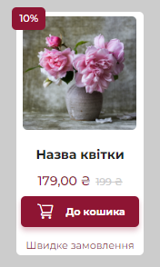
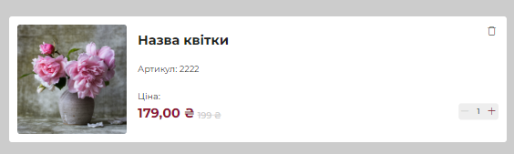
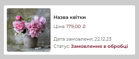
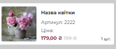
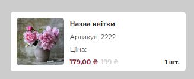
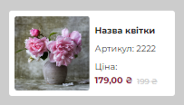
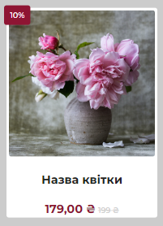
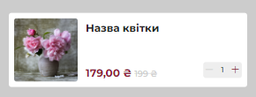
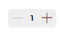

# Документація для CSS бібліотеки
У цій документації наведено опис інструкцій, класів та стилів, доступних у бібліотеці, за для того щоб слідкувати принципу DRY (Do Not Repeat Yourself). 
Документація надається українською мовою та в форматі Markdown (.md).
Також у нашій бібліотеці використовується перезапис стилів bootstrap v5.0.3 Прошу звернути на це увагу і бути уважним при розробці.

## Зміст

1. [Імпорт шрифтів](#імпорт-шрифтів)
2. [Кореневі змінні](#кореневі-змінні)
3. [Стилі для прокручування](#стилі-для-прокручування)
4. [Скидання стилів](#скидання-стилів)
5. [Основні стилі](#основні-стилі)
6. [Стилі для шрифтів](#стилі-для-шрифтів)
7. [Адаптація шрифтів](#адаптація-шрифтів)
8. [Стилі для іконок](#стилі-для-іконок)
9. [Стилі для групи елементів](#стилі-для-групи-елементів)
10. [Стилі для кнопок](#стилі-для-кнопок)
11. [Група кнопок "Call to Action"](#група-кнопок-call-to-action)
12. [Кнопки "Contact Us"](#кнопки-contact-us)
13. [Стилі для вхідних полів](#стилі-для-вхідних-полів)
14. [Cтилі для перемикачів у стилі iOS](#стилі-для-перемикачів-у-стилі-ios)
15. [Акордеон](#акордеон)

    15.1. [Акордеон з можливістю сортування](#акордеон-з-можливістю-сортування)

    15.2. [Кнопка акордеону](#кнопка-акордеону)

    15.3. [Активна кнопка акордеону](#активна-кнопка-акордеону)

    15.4. [Акордеон для сторінки користувача](#акордеон-для-сторінки-користувача)

    15.5. [Акордеон "Від... До..."](#акордеон-від-до)

16. [Картки товарі](#картки-товарів)

    16.1. [Знижка (card-DISCOUNT)](#знижка-card-discount)
    
    16.2. [Дуже великий розмір картки товару (card-XL)](#дуже-великий-розмір-картки-товару-card-xl)

    16.3. [Великий розмір картки товару (card-L)](#великий-розмір-картки-товару-card-l)

    16.4. [Середній розмір картки товару (card-M)](#середній-розмір-картки-товару-card-m)

    16.5. [Малий розмір картки товару (card-S)](#малий-розмір-картки-товару-card-s)

    16.6. [Дуже малий розмір картки товару (card-XS)](#дуже-малий-розмір-картки-товару-card-xs)

    16.7. [Картка товару для сторінки замовлення (CARD-FOR-ORDERING-PAGE-L)](#картка-товару-для-сторінки-замовлення-card-for-ordering-page-l)

    16.8. [Картка товару для сторінки замовлення (CARD-FOR-ORDERING-PAGE-S)](#картка-товару-для-сторінки-замовлення-card-for-ordering-page-s)

    16.9. [Стилі кнопки видалення (DELETE-BTN-CARD)](#стилі-кнопки-видалення-delete-btn-card)

    16.10. [Стилі лічильника (COUNTER)](#стилі-лічильника-counter)

17. [Навігаційний блок (NAVIGATION-BLOCK)](#навігаційний-блок-navigation-block)

    17.1. [Хлібні крошки (BREADCRUMBS)](#хлібні-крошки-breadcrumbs)

    17.2. [Пагінація (PAGINATION)](#пагінація-pagination)

18. [Поля введення (INPUTS)](#введення-даних-inputs)

    18.1. [Введення телефону (INPUT-PHONE-TELL)](#введення-телефону-input-phone-tell)

    18.2. [Пошукове поле (SEARCH-INPUT)](#пошукове-поле-search-input)
    
    18.3. [Слайдер Від/До (Prise-Ranger)](#слайдер-від-до-prise-ranger)

19. [Слайдери (Slider)](#слайдери-slider)

    19.1.[Слайдер для хеддеру(header-SLIDER)](#слайдер-для-хеддеру-header-slider)

    19.2.[Навігація та кнопки слайдера (SLIDE-header-NAVIGATION-AND-BOXES)](#навігація-та-кнопки-слайдера-slide-header-navigation-and-boxes)

    19.3.[Структура слайдів у слайдері (SLIDE-header-STUCTURE)](#структура-слайдів-у-слайдері-slide-header-stucture)

    19.4.[Анімація слайдера (SLIDE-ANIMATION)](#анімація-слайдера-slide-animation)

    19.5.[Опис JS-коду](#опис-js-коду)

## 1. Імпорт шрифтів <a name="імпорт-шрифтів"></a>

```css
@import url('https://fonts.googleapis.com/css2?family=Montserrat:ital,wght@0,100;0,200;0,300;0,400;0,500;0,600;0,700;0,800;0,900;1,100;1,200;1,300;1,400;1,500;1,600;1,700;1,800;1,900&display=swap');
```

Тут імпортується шрифт Montserrat з Google Fonts з різними налаштуваннями товщини та стилю.

Також, додається власний шрифт "icomoon" зі своїми файлами (.eot, .ttf, .woff, .svg) для використання.

## 2. Кореневі змінні <a name="кореневі-змінні"></a>

Ця секція містить змінні, які можна використовувати для створення стилів на сторінці.

```css
:root {
    /* КОЛЬОРИ */
    --dark-red: #CBADB4;
    --red: #8E1533;
    --light-red: #FFF2F4;
    --shadow-red-color: #8e153345;
    --darck-gray: #222220;
    --gray: #CCCCCC;
    --light-gray: #EEEEEE;
    --white: #FFFFFF;
    --aquamarine: #99FFF1;
    --shadow-red: 0px 4px 6px 0px var(--shadow-red-color);

    /* ШАРИ */
    --layer-1: 1;
    --layer-2: 20;
    --layer-3: 30;
    --layer-4: 40;
    --layer-5: 50;
    --layer-6: 99;
}
```

Ці змінні визначають палітру кольорів та шари, які можна використовувати у вашому CSS для створення стилів.
Також прошу бути дуже уважним із шарами (слоями) бо можуть виникнути пенві проблеми з цим.

## 3. Стилі для прокручування <a name="стилі-для-прокручування"></a>

```css
/* СТИЛІ ДЛЯ ПРОКРУЧУВАННЯ */

/* Вертикальна прокрутка */
::-webkit-scrollbar {
    width: 10px;
    height: 10px;
}

/* Вертикальний бігунець */
::-webkit-scrollbar-thumb {
    background: var(--red);
    border-radius: 50vh;
}
```

Ці стилі дозволяють налаштувати вигляд прокручування для блоків з вмістом, який перевищує доступну область.

## 4. Скидання стилів <a name="скидання-стилів"></a>

```css
/* СКИДАННЯ СТИЛІВ */

* {
    margin: 0;
    padding: 0;
    text-decoration: none;
}

body {
    background-color: var(--darck-gray);
    height: 100%;
    font-family: 'Montserrat', sans-serif;
    line-height: 1;
}

a {
    text-decoration: none !important;
    cursor: pointer;
    transition: .3s;
}

a:hover {
    color: var(--red);
    transition: .3s;
}

h1,
.h1,
h2,
.h2,
h3,
.h3,
h4,
.h4,
h5,
.h5,
h6,
.h6,
p,
ul,
ol,
li,
a,
button {
    margin: 0;
    padding: 0;
}
```

Ці стилі скидають значення за замовчуванням для деяких HTML-елементів, таких як `<body>`, `<a>`, `<h1>`, `<h2>`, `<h3>`, `<p>`, `<ul>`, `<ol>`, `<li>`, `<button>`, щоб забезпечити більш однорідний вигляд.

## 5. Основні стилі <a name="основні-стилі"></a>

```css
/* ОСНОВНІ СТИЛІ */

.container {
    margin: 0 auto;
    display: flex;
    flex-direction: column;
    align-items: flex-start;
    background-color: var(--white);
    border-radius: 10px;
    max-width: 500px;
    width: 100%;
    padding: 20px;
}

.dark-red

 {
    color: var(--dark-red) !important;
}

.red {
    color: var(--red) !important;
}

.light-red {
    color: var(--light-red) !important;
}

.darck-gray {
    color: var(--darck-gray) !important;
}

.gray {
    color: var(--gray) !important;
}

.light-gray {
    color: var(--light-gray) !important;
}

.white {
    color: var(--white) !important;
}

.aquamarine {
    color: var(--aquamarine) !important;
}
```

У цьому розділі наведено основні стилі, які можуть бути застосовані до елементів. Зокрема, наведені стилі контейнера та стилі кольорів.

## 6. Стилі для шрифтів <a name="стилі-для-шрифтів"></a>

```css
/* СТИЛІ ДЛЯ ШРИФТІВ */

/* H1 */
.h1-42-auto-bold {
    color: var(--dark-grey, #222220);
    font-size: 42px;
    font-weight: 700;
}

.h1-42-auto-medium {
    color: var(--dark-grey, #222220);
    font-size: 42px;
    font-family: Montserrat;
    font-weight: 500;
}

.h1-42-auto-regular {
    color: var(--dark-grey, #222220);
    font-size: 42px;
    font-family: Montserrat;
}

/* H2 */
.h2-24-auto-bold {
    color: var(--dark-grey, #222220);
    font-size: 24px;
    font-family: Montserrat;
    font-weight: 700;
}

.h2-24-auto-medium {
    color: var(--dark-grey, #222220);
    font-size: 24px;
    font-family: Montserrat;
    font-weight: 500;
}

.h2-24-auto-regular {
    color: var(--dark-grey, #222220);
    font-size: 24px;
    font-family: Montserrat;
}

.h2-24-auto-light {
    color: var(--dark-grey, #222220);
    font-size: 24px;
    line-height: 24px;
    font-family: Montserrat;
    font-weight: 300;
}

/* H3 */
.h3-20-auto-bold {
    color: var(--dark-grey, #222220);
    font-size: 20px;
    font-family: Montserrat;
    font-weight: 700;
}

.h3-20-auto-medium {
    color: var(--dark-grey, #222220);
    font-size: 20px;
    font-family: Montserrat;
    font-weight: 500;
}

.h3-20-auto-regular {
    color: var(--dark-grey, #222220);
    font-size: 20px;
    font-family: Montserrat;
}

.h3-20-auto-light {
    color: var(--dark-grey, #222220);
    font-size: 20px;
    font-family: Montserrat;
    font-weight: 300;
}

/* Paragraph */
.p-16-auto-bold {
    color: var(--dark-grey, #222220);
    font-size: 16px;
    font-family: Montserrat;
    font-weight: 700;
}

.p-16-auto-medium {
    color: var(--dark-grey, #222220);
    font-size: 16px;
    font-family: Montserrat;
    font-weight: 500;
}

.p-16-auto-regular {
    color: var(--dark-grey, #222220);
    font-size: 16px;
    font-family: Montserrat;
}

.p-14-auto-bold {
    color: var(--dark-grey, #222220);
    font-size: 14px;
    font-family: Montserrat;
    font-weight: 700;
}

.p-14-auto-medium {
    color: var(--dark-grey, #222220);
    font-size: 14px;
    font-family: Montserrat;
    font-weight: 500;
}

.p-14-auto-regular {
    color: var(--dark-grey, #222220);
    font-size: 14px;
    font-family: Montserrat;
}

.p-14-auto-light {
    color: var(--dark-grey, #222220);
    font-size: 14px;
    font-family: Montserrat;
    font-weight: 300;
}
```

У цьому розділі наведено стилі для різних типів текстових елементів, таких як заголовки (h1, h2, h3), абзаци (p) та посилання (a).

## 7. Адаптація шрифтів <a name="адаптація-шрифтів"></a>

```css
/* АДАПТАЦІЯ ШРИФТІВ */

@media screen and (max-width: 700px) {
    .container {
        max-width: 300px;
    }

    .h1-42-auto-bold {
        font-size: 16px;
        font-family: Montserrat;
        font-weight: 700;
    }

    .h1-42-auto-medium {
        font-size: 16px;
        font-family: Montserrat;
        font-weight: 500;
    }

    .h1-42-auto-regular {
        font-size: 16px;
        font-family: Montserrat;
    }

    .h2-24-auto-bold {
        font-size: 14px;
        font-family: Montserrat;
        font-weight: 700;
    }

    .h2-24-auto-medium {
        font-size: 14px;
        font-family: Montserrat;
        font-weight: 500;
    }

    .h2-24-auto-regular {
        font-size: 14px;
        font-family: Montserrat;
    }

    .h2-24-auto-light {
        font-size: 14px;
        font-family: Montserrat;
        font-weight: 300;
    }

    .h3-20-auto-bold {
        font-size: 12px;
        font-family: Montserrat;
        font-weight: 700;
    }

    .h3-20-auto-medium {
        font-size: 12px;
        font-family: Montserrat;
        font-weight: 500;
    }

    .h3-20-auto-regular {
        font-size: 12px;
        font-family: Montserrat;
    }

    .h3-20-auto-light {
        font-size: 12px;
        font-family: Montserrat;
        font-weight: 300;
    }

    .p-16-auto-bold {
        font-size: 11px;
        font-family: Montserrat;
        font-weight: 700;
    }

    .p-16-auto-medium {
        font-size: 11px;
        font-family: Montserrat;
        font-weight: 500;
    }

    .p-16-auto-regular {
        font-size: 11px;
        font-family: Montserrat;
    }

    .p-14-auto-bold {
        font-size: 10px;
        font-family: Montserrat;
        font-weight: 300;
    }

    .p-14-auto-medium {
        font-size: 10px;
        font-family: Montserrat;
        font-weight: 700;
    }

    .p-14-auto-regular {
        font-size: 10px;
        font-family: Montserrat;
        font-weight: 500;
    }

    .p-14-auto-light {
        font-size: 10px;
        font-family: Montserrat;
    }
}
```

Ці стилі відповідають за адаптацію шрифтів для різних розмірів екрану. У розділі `@media` визначаються стилі для елементів при роздільній здатності екрану менше 700px.


## 8. Стилі для іконок <a name="стилі-для-іконок"></a>

```css
/* СТИЛІ ДЛЯ ІКОНОК */

.icon {
    font-family: 'icomoon';
    font-size: 24px;
    font-weight: 500;
    line-height: 1;
}

@media screen and (max-width: 700px) {
    .icon {
        font-size: 24px;
        line-height: 1;
    }
}
```

У цьому розділі наведено стилі для іконок, які використовують шрифтову іконку `icomoon`. Застосування цих стилів дозволяє легко використовувати іконки у вашому HTML-коді, присвоюючи клас `icon` до елементів, де потрібно показати іконку.

## 9. Стилі для групи елементів <a name="стилі-для-групи-елементів"></a>

```css
/* СТИЛІ ДЛЯ ГРУПИ ЕЛЕМЕНТІВ */

.group {
    display: flex;
    align-items: center;
    flex-wrap: wrap;
    gap: 20px;
    padding: 100px 20px;
    margin: 0 20px 30px;
    border-radius: 10px;
    background-color: var(--gray);
}

@media screen and (max-width: 700px) {
    .group {
        flex-direction: column;
        padding: 15px 10px;
    }
}
```

У цьому розділі наведено стилі для групи елементів з класом `group`. Він потрібен лише як свого роду тестовий-контайнер для елементів. 

## 10. Стилі для кнопок <a name="стилі-для-кнопок"></a>

```css
/* СТИЛІ ДЛЯ КНОПОК */

.button-main {
    display: inline-flex;
    justify-content: center;
    align-items: center;
    text-align: center;
    width: auto;
    padding: 15px 30px;
    gap: 10px;
    border-radius: 5px;
    background: var(--red, #8E1533);
    color: var(--white, #FFF);
    box-shadow: var(--shadow-red);
    border: none;
    cursor: pointer;
    transition: .3s;
}

@media screen and (max-width: 700px) {
    .button-main {
        padding: 5px 15px;
        line-height: 24px;
    }
}

.button-main:hover,
.cta-button:hover,
.contact-us-btn:hover {
    background: var(--gray);
    color: var(--white, #FFF);
    transition: .3s;
}
```

Ці стилі застосовуються до кнопок, які мають клас `button-main`.

## 11. Група кнопок "Call to Action" <a name="група-кнопок-call-to-action"></a>

```css
/* ГРУПА КНОПОК "CALL TO ACTION" */

.cta-btn-group {
    display: flex;
    flex-direction: column;
    gap: 20px;
    position: fixed;
    bottom: 60px;
    right: 60px;
    z-index: var(--layer-5);
}

@media screen and (max-width: 700px) {
    .cta-btn-group {
        gap: 10px;
        bottom: 15px;
        right: 15px;
    }
}

.cta-button {
    display: inline-flex;
    justify-content: center;
    align-items: center;
    width: auto;
    padding: 20px;
    border-radius: 50vh;
    background: var(--red, #8E1533);
    color: var(--white, #FFF);
    box-shadow: var(--shadow-red);
    cursor: pointer;
}

@media screen and (max-width: 700px) {
    .cta-button {
        padding: 12px;
    }
}

.cta-button .icon {
    font-size: 28px;
    line-height: 1;
    font-weight: 500;
}

@media screen and (max-width: 700px) {
    .cta-button .icon {
        font-size: 24px;
    }
}
```

У цьому розділі наведено стилі для групи кнопок "Call to Action" (кнопок, що стимулюють дії користувачів). Ця кнопка використовується для виклаканння деккількох інших кнопок з посиланнями до інстаграмму.
## 12. Кнопки "Contact Us" <a name="кнопки-contact-us"></a>

```css
/* КНОПКИ "CONTACT US" */

.contact-us {
    position: relative;
}

.contact-us-btn-group {
    display: none;
}

.contact-us-btn {
    display: inline-flex;
    justify-content: center;
    align-items: center;
    width: 68px;
    height: 68px;
    border-radius: 50vh;
    background: var(--red);
    color: var(--white, #FFF);
    position: absolute;
    transform: translate(-50%, -50%);


    font-size: 50px;
    line-height: 1;
}

.contact-us-btn:nth-child(1) {
    right: 70px;
    top: 50%;
    background: #7E57C2;
}

.contact-us-btn:nth-child(2) {
    right: 45px;
    top: -70%;
    background: linear-gradient(180deg, #2AABEE 0%, #229ED9 100%);
}

.contact-us-btn:nth-child(3) {
    left: 50%;
    bottom: 70px;
    background: linear-gradient(0deg, #20B038 0%, #60D66A 100%);
}

.show-contact-us-btn-group {
    display: block;
}

.show-contact-us-btn-group .cta-button {
    transform: translateX(-120px) translateY(-120px);
    transition: transform 0.5s;
}

@media screen and (max-width: 700px) {
    .contact-us-btn {
        width: 48px;
        height: 48px;
        font-size: 30px;
    }

    .contact-us-btn:nth-child(1) {
        right: 40px;
        top: 50%;
    }

    .contact-us-btn:nth-child(2) {
        right: 30px;
        top: -60%;
    }

    .contact-us-btn:nth-child(3) {
        left: 50%;
        bottom: 40px;
    }
}
```

Вони надають ефекту "плаваючої" кнопки з використанням позиціонування і анімації. Ці кнопки використовуються як посилання до наших соц. мереж. Також ці кнопки використвують класс <icon> у HTML.
## 13. Стилі для вхідних полів <a name="стилі-для-вхідних-полів"></a>

```css
/* СТИЛІ ДЛЯ ВХІДНИХ ПОЛІВ */

.form-check-input {
    width: 20px;
    height: 20px;
    margin-top: 0;
    vertical-align: top;
    background-color: var(--white);
    background-repeat: no-repeat;
    background-position: center;
    background-size: contain;
    border: 1px solid var(--gray);
    -webkit-appearance: none;
    -moz-appearance: none;
    appearance: none;
    -webkit-print-color-adjust: exact;
    color-adjust: exact;
}

.form-check-input:checked {
    background-color: var(--red, #8E1533);
    border-color: var(--red, #8E1533);
}

.form-check-input:focus {
    border-color: var(--red);
    outline: 0;
    box-shadow: var(--shadow-red);
}
```

Ці стилі застосовуються до вхідних полів, які мають клас `form-check-input`. Вони створюють стилізацію для відмічених та невідмічених вхідних полів, зокрема встановлюють розмір, внутрішні відступи, обрамлення та інші властивості. Крім того, наведено стилі для фокусування на вхідних полях.

## 14. Стилі для перемикачів у стилі iOS <a name="стилі-для-перемикачів-у-стилі-ios"></a>

```css
/* СТИЛІ ДЛЯ ПЕРЕМИКАЧІВ У СТИЛІ iOS */

.toggle-switch {
    position: relative;
    display: inline-flex;
    width: 35px;
    height: 20px;
}

.toggle-switch input {
    opacity: 0;
    width: 0;
    height: 0;
}

.toggle-switch label {
    position: absolute;
    top: 0;
    left: 0;
    right: 0;
    bottom: 0;
    background-color: var(--light-red);
    border-radius: 50vw;
    cursor: pointer;
    transition: background-color 0.3s ease;
}

.toggle-switch label:before {
    content: "";
    position: absolute;
    top: 50%;
    left: 3px;
    width: 13px;
    height: 13px;
    background-color: var(--white);
    border-radius: 50vw;
    transform: translate(0, -50%);
    transition: transform 0.3s ease;
}

.toggle-switch input:checked+label {
    background-color: var(--red);
}

.toggle-switch input:checked+label:before {
    transform: translate(17px, -50%);
}

@media screen and (max-width: 700px) {
    .toggle-switch label:before {
        left: 3px;
    }

    .toggle-switch input:checked+label:before {
        transform: translate(15px, -50%);
    }
}
```

У цьому розділі наведено стилі для перемикачів (toggle switches) у стилі iOS. Вони надають вигляд перемикачам, схожим на ті, що використовуються у пристроях Apple. Застосування класу `toggle-switch` до вхідних полів дозволяє застосовувати ці стилі до ваших перемикачів.

## 15. Акордеон <a name="акордеон"></a>

```css
/* ACCORDION */

.accordion-button:focus {
    z-index: var(--layer-2);
    border-color: var(--aquamarine);
    outline: 0;
    box-shadow: 0 0 0 1px var(--aquamarine);
}
```
Це налаштування перезаписує головні стилі bootstrap для акардконів.
Ці стилі визначають зовнішній вигляд для елементів акордеону, коли вони отримують фокус. Зокрема, стилі задають порядок накладання шарів (z-index), колір рамки, тінь і акцентують активний елемент акордеону під час фокусування.

## 15.1. Акордеон з можливістю сортування <a name="акордеон-з-можливістю-сортування"></a>

```css
/* ACCORDION-SORT */

.accordion-sort {
    max-width: 250px;
    width: 100%;
}

.accordion-sort .accordion-item {
    background-color: var(--white);
    border: 1px solid var(--light-gray);
}

.accordion-button:not(.collapsed) {
    color: var(--darck-gray);
    background-color: var(--light-red);
    box-shadow: none;
}

.accordion-item:last-of-type {
    border-bottom-right-radius: 5px;
    border-bottom-left-radius: 5px;
}

.accordion-item:first-of-type {
    border-top-left-radius: 5px;
    border-top-right-radius: 5px;
}

.accordion-sort .accordion-body ul {
    display: flex;
    flex-direction: column;
    align-items: flex-start;
    gap: 10px;
}

.accordion-button {
    position: relative;
    display: flex;
    align-items: center;
    width: 100%;
    padding: 10px 15px;
}

@media screen and (max-width: 700px) {
    .accordion-sort {
        max-width: 100%;
        width: 100%;
    }

    .accordion-sort .accordion-body {
        padding: 12px 10px;
    }
}
```

Ці стилі стосуються акордеону з можливістю сортування та тут іде перезапис існуючих стилей bootstrap. 
Елементи акордеону мають фоновий колір і обрамлення. 
Застосування класу `.collapsed` до елемента `.accordion-button` визначає стилі для згорнутих елементів акордеону. 
Крім того, останній елемент має зроблені заокруглені кути знизу, а перший - зверху. Налаштовані стилі для відображення списку елементів у вертикальному положенні.

## 15.2. Кнопка акордеону <a name="кнопка-акордеону"></a>

```css
/* ACCORDION-BTN */

.accordion-button::after {
    flex-shrink: 0;
    margin-left: auto;
    content: "";
    font-size: 24px;
    font-family: 'icomoon';
    background-image: none;
    transform: rotate(-180deg);
    transition: transform .2s ease-in-out;
    display: flex;
    justify-content: center;
    align-items: center;
}

.accordion-sort .accordion-button:focus {
    z-index: 3;
    border-color: var(--light-red);
    outline: 0;
    box-shadow: none;
}
```

Ці стилі стосуються зовнішнього вигляду кнопок акордеону. Кнопка має символ позначення, що вказує на згортання або розгортання елемента. При фокусуванні кнопки задано стилі для зміни зовнішнього вигляду.

## 15.3. Активна кнопка акордеону <a name="активна-кнопка-акордеону"></a>

```css
/* ACCORDION-BTN-ACTIVE */

.accordion-button:not(.collapsed)::after {
    content: "";
    font-family: 'icomoon';
    font-size: 24px;
    background-image: none;
    transform: rotate(0);
    display: flex;
    justify-content: center;
    align-items: center;
}
```

Ці стилі визначають зовнішній вигляд активної кнопки акордеону (тобто коли елемент розгорнуто). При цьому змінюється символ позначення, який вказує на активний стан.

## 15.4. Акордеон для сторінки користувача <a name="акордеон-для-сторінки-користувача"></a>

```css
/* ACCORDION-USER-PAGE */

.accordion-user-page {
    max-width: 460px;
    width: 100%;
}

.accordion-user-page .accordion-body ul {
    display: flex;
    flex-direction: column;
    gap: 10px;
}

.accordion-user-page .accordion-item {
    background-color: var(--white);
    border: 1px solid var(--light-gray);
}

.accordion-user-page .accordion-button:focus {
    z-index: 3;
    border-color: var(--light-red);
    outline: 0;
    box-shadow: 0px 0px 0px 1px var(--aquamarine);
}

.accordion-user-page .accordion-button:not(.collapsed) {
    color: var(--darck-gray);
    background-color: var(--light-red);
    box-shadow: 0px 0px 0px 0px var(--aquamarine);
}

@media screen and (max-width: 700px) {
    .accordion-user-page {
        max-width: 100%;
        width: 100%;
    }

    .accordion-user-page .accordion-body {
        padding: 12px 10px;
    }
}
```

Ці стилі стосуються акордеону на сторінці користувача. Застосовуються стилі для контейнера акордеону, елементів списку, а також задається зовнішній вигляд для кнопок акордеону при фокусуванні і активному стані.

## 15.5. Акордеон "Від... До..." <a name="акордеон-від-до"></a>

```css
/* ACCORDION-FROM-TO */

.accordion-from-to {
    max-width: 295px;
    width: 100%;
    display: flex;
    flex-direction: column;
    gap: 20px;
}

.accordion-from-to .accordion-item {
    background-color: var(--white);
    border: none;
}

.accordion-from-to .accordion-button:not(.collapsed) {
    color: var(--darck-gray);
    background-color: var(--white);
}

.accordion-from-to .accordion-item {
    border-radius: 5px;
}

.accordion-from-to .accordion-body ul {
    display: flex;
    flex-direction: column;
    align-items: flex-start;
    gap: 10px;
}

@media screen and (max-width: 700px) {
    .accordion-from-to {
        max-width: 100%;
        width: 100%;
    }

    .accordion-from-to .accordion-body {
        padding: 10px;
    }
}
```

Ці стилі стосуються акордеону "Від... До..." (from-to). Застосовуються стилі для контейнера акордеону та його елементів, які здійснюють відображення відповідних полів для вибору дат "від" і "до". Крім того, стилі задають зовнішній вигляд для активних елементів, коли обрані дати "від" і "до".

## 16. Картки товарів <a name="картки-товарів"></a>

### 16.1. Знижка (card-DISCOUNT) <a name="знижка-card-discount"></a>

```css
/* card-DISCOUNT */

.discount {
    padding: 12px 12px;
    display: flex;
    justify-content: center;
    align-items: center;
    background-color: var(--red);
    position: absolute;
    top: -5px;
    left: -5px;
    border-radius: 5px;
}

.old-price p {
    text-decoration: line-through;
    color: var(--gray);
}

@media screen and (max-width: 700px) {
    .discount {
        padding: 7px 8px;
    }
}
```

Ці стилі стосуються відображення знижки на товар у кошику. Знижка відображається у вигляді плашки (`discount`) з червоним фоном, що знаходиться над товаром, який має знижку. Крім того, для зниженої ціни використовується підкреслений текст з використанням `text-decoration: line-through` і сірого кольору для кращої видимості.

### 16.2. Дуже великий розмір картки товару (card-XL) <a name="дуже-великий-розмір-картки-товару-card-xl)"></a>




```css
/* card-XL */

.card-xl {
    display: flex;
    flex-direction: column;
    align-items: center;
    position: relative;
    gap: 20px;
    padding: 5px;
    background-color: var(--white);
    border-radius: 5px;
}

.card-xl .img-box {
    width: 100%;
    max-width: 300px;
}

.card-xl .img-box img {
    width: 100%;
    border-radius: 5px;
}

.card-xl .prod-desc {
    display: flex;
    flex-direction: column;
    align-items: center;
    gap: 10px;
}

.card-xl .prod-title {
    width: 100%;
    display: flex;
    align-items: center;
    justify-content: center;
    overflow-wrap: break-word;
    height: 56px;
}

.card-xl .prod-title h3 {
    max-width: 300px;
    width: 100%;
    text-align: center;
}

.card-xl .prod-desc .prod-price {
    display: flex;
    flex-direction: row;
    gap: 5px;
    justify-content: space-between;
    align-items: baseline;
}

.card-xl .card-btn {
    display: flex;
    flex-direction: column;
    align-items: center;
    gap: 15px;
}

@media screen and (max-width: 700px) {
    .card-xl {
        gap: 10px;
        padding: 5px;
        background-color: var(--white);
        border-radius: 5px;
    }

    .card-xl .img-box {
        max-width: 125px;
    }

    .card-xl .prod-title {
        max-width: 125px;
        height: 34px;
    }

    .card-xl .prod-desc {
        display: flex;
        flex-direction: column;
        align-items: center;
        gap: 5px;
    }

    .card-xl .prod-title h3 {
        max-width: 125px;
        width: 100%;
    }

    .card-xl .prod-desc .prod-price {
        gap: 5px;
    }

    .card-xl .card-btn {
        gap: 15px;
    }
}
```

Ці стилі стосуються великого розміру картки товару у кошику (`card-XL`). Велика картка товару містить зображення товару (`img-box`), заголовок товару (`prod-title`), інформацію про ціну (`prod-price`) та кнопки дій із товаром (`card-btn`). Велика картка має заданий максимальний розмір зображення товару, а також регулює розмір та розташування заголовка товару та кнопок дій для різних розмірів екрану (`@media screen and (max-width: 700px)`).

### 16.2. Великий розмір картки товару (card-L)<a name="великий-розмір-картки-товару-card-l)"></a>




```css
/* card-L */

.card-l {
    display: flex;
    flex-direction: row;
    position: relative;
    background-color: var(--white);
    padding: 15px;
    gap: 20px;
    border-radius: 5px;
    max-width: 910px;
    width: 100%;
}

.card-l .img-box {
    width: 100%;
    max-width: 200px;
}

.card-l .img-box img {
    width: 100%;
    border-radius: 5px;
}

.card-l .card-top {
    width: 100%;
    display: flex;
    flex-direction: row;
    justify-content: space-between;
}

.card-l .prod-desc {
    width: 100%;
    display: flex;
    flex-direction: column;
    align-items: flex-start;
    gap: 35px;
}

.card-l .prod-desc .prod-title {
    display: flex;
    flex-direction: column;
    max-width: 400px;
    width: 100%;
    gap: 15px;
    overflow-wrap: break-word;
}

.card-l .prod-desc .prod-title h3 {
    height: 58px;
    width: 100%;
    display: flex;
    align-items: center;
    text-align: left;
}

.card-l .card-bottom {
    width: 100%;
    display: flex;
    flex-direction: row;
    justify-content: space-between;
    align-items: flex-end;
}

.card-l .prod-desc .prod-price {
    display: flex;
    flex-direction: row;
    gap: 5px;
    justify-content: space-between;
    align-items: end;
}

.card-l .prod-desc .prod-price .current-price {
    display: flex;
    flex-direction: column;
    align-items: flex-start;
    gap: 10px;
}

@media screen and (max-width: 700px) {
    .card-l {
        background-color: var(--white);
        padding: 10px;
        gap: 10px;
        max-width: 310px;
        width: 100%;
    }

    .card-l .img-box {
        width: 100%;
        max-width: 80px;
    }

    .card-l .img-box img {
        width: 100%;
        border-radius: 5px;
    }

    .card-l .card-top {
        width: 100%;
    }

    .card-l .prod-desc {
        width: 100%;
        gap: 5px;
    }

    .card-l .prod-desc .prod-title {
        max-width: 170px;
        gap: 5px;
        overflow-wrap: break-word;
    }

    .card-l .prod-desc .prod-title h3 {
        height: 28px;
        width: 100%;
        display: flex;
        align-items: center;
        text-align: left;
    }

    .card-l .card-bottom {
        width: 100%;
    }

    .card-l .prod-desc .prod-price {
        gap: 5px;
    }

    .card-l .prod-desc .prod-price .current-price {
        display: flex;
        flex-direction: column;
        align-items: flex-start;
        gap: 5px;
    }
}
```

Ці стилі стосуються середнього розміру картки товару у кошику (`card-L`). Середній розмір картки має подібний вигляд до великого розміру картки, але з більш обмеженим максимальним розміром зображення товару і розміром заголовка товару для малих екранів (`@media screen and (max-width: 700px)`).

### 16.4. Середній розмір картки товару (card-M)<a name="середній-розмір-картки-товару-card-m"></a>




```css
/* card-M */

.card-m {
    display: flex;
    flex-direction: row;
    position: relative;
    background-color: var(--white);
    padding: 10px;
    gap: 10px;
    border-radius: 5px;
    max-width: 450px;
    width: 100%;
}

.card-m .img-box {
    width: 100%;
    max-width: 150px;
}

.card-m .img-box img {
    width: 100%;
    border-radius: 5px;
}

.card-m .card-top {
    width: 100%;
    display: flex;
    flex-direction: row;
    justify-content: space-between;
}

.card-m .prod-desc {
    width: 100%;
    display: flex;
    flex-direction: column;
    align-items: flex-start;
    justify-content: space-between;
    padding: 10px 0;
    gap: 20px;
}

.card-m .prod-desc .prod-title {
    display: flex;
    flex-direction: column;
    gap: 5px;
}

.card-m .prod-desc .prod-title h3 {
    height: 40px;
    max-width: 250px;
    text-align: left;
    display: flex;
    align-items: center;
    overflow-wrap: break-word;
}

.card-m .prod-desc .prod-title .prod-price {
    display: flex;
    flex-direction: row;
    gap: 3px;
}

.card-m .card-bottom {
    width: 100%;
    display: flex;
    flex-direction: row;
    justify-content: space-between;
    align-items: flex-end;
}

.card-m .prod-desc .card-bottom .product-info {
    display: flex;
    flex-direction: column;
    gap: 10px;
    justify-content: space-between;
    align-items: start;
}

.card-m .prod-desc .card-bottom .product-info .product-order-date,
.card-m .prod-desc .card-bottom .product-info .product-order-status {
    display: flex;
    flex-direction: row;
    gap: 3px;
}

@media screen and (max-width: 700px) {
    .card-m {
        background-color: var(--white);
        padding: 10px;
        gap: 10px;
        border-radius: 5px;
        max-width: 310px;
        width: 100%;
    }

    .card-m .img-box {
        width: 100%;
        max-width: 80px;
    }

    .card-m .card-top {
        width: 100%;
    }

    .card-m .prod-desc {
        width: 100%;
        padding: 0;
    }

    .card-m .prod-desc .prod-title {
        display: flex;
        flex-direction: column;
        gap: 5px;
    }

    .card-m .prod-desc .prod-title h3 {
        height: 22px;
        max-width: 200px;
        text-align: left;
    }

    .card-m .prod-desc .prod-title .prod-price {
        gap: 3px;
    }

    .card-m .card-bottom {
        width: 100%;
    }

    .card-m .prod-desc .card-bottom .product-info {
        display: flex;
        flex-direction: column;
        gap: 10px;
        justify-content: space-between;
        align-items: start;
    }
}
```

Ці стилі стосуються малого розміру картки товару у кошику (`card-M`). Малий розмір картки має подібний вигляд до середнього розміру картки, але з ще більш обмеженим максимальним розміром зображення товару і розміром заголовка товару для малих екранів (`@media screen and (max-width: 700px)`).

### 16.5. Малий розмір картки товару (card-S) <a name="малий-розмір-картки-товару-card-s"></a>





```css
/* card-S */

.card-s {
    display: flex;
    flex-direction: row;
    position: relative;
    background-color: var(--white);
    padding: 10px;
    gap: 15px;
    border-radius: 5px;
    max-width: 380px;
    width: 100%;
}

.card-s .img-box {
    width: 100%;
    max-width: 115px;
}

.card-s .img-box img {
    width: 100%;
    border-radius: 5px;
}

.card-s .card-top {
    width: 100%;
    display: flex;
    flex-direction: row;
    justify-content: space-between;
}

.card-s .prod-desc {
    width: 100%;
    display: flex;
    flex-direction: column;
    align-items: flex-start;
    gap: 10px;
}

.card-s .prod-desc .prod-title {
    display: flex;
    flex-direction: column;
    gap: 5px;
}

.card-s .prod-desc .prod-title h3 {
    max-width: 220px;
    width: 100%;
    height: 40px;
    display: flex;
    align-items: center;
    text-align: left;
    overflow-wrap: break-word;
}


.card-s .card-bottom {
    width: 100%;
    display: flex;
   

 flex-direction: row;
    justify-content: space-between;
    align-items: flex-end;
}

.card-s .prod-desc .prod-price {
    display: flex;
    flex-direction: row;
    gap: 5px;
    justify-content: space-between;
    align-items: end;
}

.card-s .prod-desc .prod-price .current-price {
    display: flex;
    flex-direction: column;
    align-items: flex-start;
    gap: 10px;
}

@media screen and (max-width: 700px) {
    .card-s {
        padding: 10px;
        gap: 10px;
        border-radius: 5px;
        max-width: 295px;
        width: 100%;
    }

    .card-s .img-box {
        max-width: 80px;
    }

    .card-s .prod-desc {
        width: 100%;
        display: flex;
        flex-direction: column;
        align-items: flex-start;
        gap: 10px;
    }

    .card-s .prod-desc .prod-title h3 {
        max-width: 190px;
        height: 22px;
    }

    .card-s .prod-desc .prod-title {
        display: flex;
        flex-direction: column;
        gap: 5px;
    }
}
```

Ці стилі стосуються дуже малого розміру картки товару у кошику (`card-S`). Дуже малий розмір картки має подібний вигляд до малого розміру картки, але з ще більш обмеженим максимальним розміром зображення товару і розміром заголовка товару для малих екранів (`@media screen and (max-width: 700px)`).

### 16.6. Дуже малий розмір картки товару (card-XS) <a name="дуже-малий-розмір-картки-товару-card-xs"></a>




```css
/* card-XS */

.card-xs {
    display: flex;
    flex-direction: row;
    position: relative;
    background-color: var(--white);
    padding: 10px;
    gap: 10px;
    border-radius: 5px;
    max-width: 305px;
    width: 100%;
}

.card-xs .img-box {
    width: 100%;
    max-width: 150px;
}

.card-xs .img-box img {
    width: 100%;
    border-radius: 5px;
}

.card-xs .card-top {
    width: 100%;
    height: 50%;
    display: flex;
    flex-direction: row;
    justify-content: space-between;
}

.card-xs .prod-desc {
    width: 100%;
    display: flex;
    flex-direction: column;
    align-items: flex-start;
    justify-content: space-between;
    padding: 10px 0;
}

.card-xs .prod-desc .prod-title {
    display: flex;
    flex-direction: column;
    gap: 10px;
}

.card-xs .prod-desc .prod-title h3 {
    max-width: 130px;
    width: 100%;
    height: 38px;
    display: flex;
    align-items: center;
    text-align: left;
    overflow-wrap: break-word;
}


.card-xs .card-bottom {
    width: 100%;
    height: 50%;
    display: flex;
    flex-direction: row;
    justify-content: space-between;
    align-items: flex-end;
}

.card-xs .prod-desc .prod-price {
    display: flex;
    flex-direction: row;
    gap: 8px;
    justify-content: space-between;
    align-items: end;
}

.card-xs .prod-desc .prod-price .current-price {
    display: flex;
    flex-direction: column;
    align-items: flex-start;
    gap: 10px;
}

@media screen and (max-width: 700px) {
    .card-xs {
        padding: 10px;
        gap: 10px;
        border-radius: 5px;
        max-width: 225px;
    }

    .card-xs .img-box {
        width: 100%;
        max-width: 70px;
    }

    .card-xs .img-box img {
        width: 100%;
        border-radius: 5px;
    }

    .card-xs .card-top {
        width: 100%;
        height: 55%;
    }

    .card-xs .prod-desc {
        width: 100%;
        padding: 0;
    }

    .card-xs .prod-desc .prod-title {
        display: flex;
        flex-direction: column;
        gap: 5px;
    }

    .card-xs .prod-desc .prod-title h3 {
        height: 22px;
    }

    .card-xs .card-bottom {
        width: 100%;
        height: 50%;
    }

    .card-xs .prod-desc .prod-price {
        gap: 8px;
    }

    .card-xs .prod-desc .prod-price .current-price {
        display: flex;
        flex-direction: column;
        align-items: flex-start;
        gap: 5px;
    }
}
```

Ці стилі стосуються найменшого розміру картки товару у кошику (`card-XS`). Найменший розмір картки має подібний вигляд до дуже малого розміру картки, але з ще більш обмеженим максимальним розміром зображення товару і розміром заголовка товару для малих екранів (`@media screen and (max-width: 700px)`).

### 16.7. Картка товару для сторінки замовлення (CARD-FOR-ORDERING-PAGE-L)<a name="картка-товару-для-сторінки-замовлення-card-for-ordering-page-l"></a>




```css
/* CARD-FOR-ORDERING-PAGE-L */

.card-order-l {
    display: flex;
    flex-direction: column;
    align-items: center;
    position: relative;
    gap: 20px;
    padding: 5px;
    background-color: var(--white);
    border-radius: 5px;
}

.card-order-l .img-box {
    width: 100%;
    max-width: 300px;
}

.card-order-l .img-box img {
    width: 100%;
    border-radius: 5px;
}

.card-order-l .prod-desc {
    display: flex;
    flex-direction: column;
    align-items: center;
    gap: 20px;
}

.card-order-l .prod-title {
    width: 100%;
    display: flex;
    align-items: center;
    justify-content: center;
    overflow-wrap: break-word;
    height: 56px;
}

.card-order-l .prod-title h3 {
    max-width: 300px;
    width: 100%;
    text-align: center;
}

.card-order-l .prod-desc .prod-price {
    display: flex;
    flex-direction: row;
    gap: 5px;
    justify-content: space-between;
    align-items: baseline;
}

.card-order-l .card-btn {
    display: flex;
    flex-direction: column;
    align-items: center;
    gap: 5px;
}

@media screen and (max-width: 700px) {
    .card-order-l {
        gap: 5px;
        padding: 5px;
        background-color: var(--white);
        border-radius: 5px;
    }

    .card-order-l .img-box {
        max-width: 125px;
    }

    .card-order-l .prod-title {
        max-width: 125px;
        height: 34px;
    }

    .card-order-l .prod-desc {
        display: flex;
        flex-direction: column;
        align-items: center;
        gap: 5px;
    }

    .card-order-l .prod-title h3 {
        max-width: 125px;
        width: 100%;
    }

    .card-order-l .prod-desc .prod-price {
        gap: 5px;
    }

    .card-order-l .card-btn {
        gap: 15px;
    }
}
```

Ці стилі стосуються великого розміру картки товару для сторінки замовлення (`CARD-FOR-ORDERING-PAGE-L`). Великий розмір картки має спеціальний стиль для відображення на сторінці оформлення замовлення з більшим розміром зображення товару та збільшеним максимальним розміром заголовка товару. Ці дві карти будуть використовуватися тільки на сторінці оформлення замовлення.

### 16.8. Картка товару для сторінки замовлення (CARD-FOR-ORDERING-PAGE-S)<a name="картка-товару-для-сторінки-замовлення-card-for-ordering-page-s"></a>




```css
/* CARD-FOR-ORDERING-PAGE-S */

.card-order-s {
    display: flex;
    flex-direction: row;
    position: relative;
    background-color: var(--white);
    padding: 10px;
    gap: 15px;
    border-radius: 5px;
    max-width: 450px;
    width: 100%;
}

.card-order-s .img-box {
    width: 100%;
    max-width: 120px;
}

.card-order-s .img-box img {
    width: 100%;
    border-radius: 5px;
}

.card-order-s .card-top {
    width: 100%;
    display: flex;
    flex-direction: row;
    justify-content: space-between;
}

.card-order-s .prod-desc {
    width: 100%;
    display: flex;
    flex-direction: column;
    align-items: center;
    justify-content: center;
    gap: 35px;
}

.card-order-s .prod-desc .prod-title {
    display: flex;
    flex-direction: column;
    gap: 5px;
}

.card-order-s .prod-desc .prod-title h3 {
    height: 42px;
    max-width: 290px;
    width: 100%;
    text-align: left;
    overflow-wrap: break-word;
}

.card-order-s .card-bottom {
    width: 100%;
    display: flex;
    flex-direction: row;
    justify-content: space-between;
    align-items: flex-end;
}

.card-order-s .prod-desc .prod-price {
    display: flex;
    flex-direction: row;
    gap: 5px;
    justify-content: space-between;
    align-items: end;
}

.card-order-s .prod-desc .prod-price .current-price {
    display: flex;
    flex-direction: column;
    align-items: flex-start;
    gap: 10px;
}

@media screen and (max-width: 700px) {
    .card-order-s {
        padding: 10px;
        gap: 10px;
        border-radius: 5px;
        max-width: 295px;
        width: 100%;
    }

    .card-order-s .img-box {
        max-width: 70px;
    }

    .card-order-s .prod-desc {
        width: 100%;
        display: flex;
        flex-direction: column;
        align-items: flex-start;
        gap: 10px;
    }

    .card-order-s .prod-desc .prod-title h3 {
        height: 28px;
        max-width: 190px;
    }

    .card-order-s .prod-desc .prod-title {
        display: flex;
        flex-direction: column;
        gap: 5px;
    }

    .card-order-s .card-bottom {
        width: 100%;
        align-items: center;
    }
}
```

Ці стилі стосуються меншого розміру картки товару для сторінки замовлення (`CARD-FOR-ORDERING-PAGE-S`). Менший розмір картки має спеціальний стиль для відображення на сторінці оформлення замовлення з меншим розміром зображення товару та зменшеним максимальним розміром заголовка товару.

### 16.9. Стилі кнопки видалення (DELETE-BTN-CARD)<a name="стилі-кнопки-видалення-delete-btn-card"></a>

```css
/* DELETE-BTN-card */

.delete-button {
    border: none;
    background-color: var(--white);
    transition: .3s;
}

.delete-button:hover {
    color: var(--red);
    transition: .3s;
}
```

Ці стилі стосуються кнопки видалення (`DELETE-BTN-CARD`). Кнопка має спеціальний стиль для відображення на картках товарів, де при наведенні миші змінюється колір тексту на червоний.

### 16.10. Стилі лічильника (COUNTER)<a name="стилі-лічильника-counter"></a>



```css
/* COUNTER */

.counter {
    background-color: var(--light-gray);
    display: flex;
    flex-direction: row;
    align-items: center;
    gap: 10px;
    border-radius: 5px;
    height: 30px;
}

@media screen and (max-width: 700px) {
    .counter {
        background-color: var(--light-gray);
        display: flex;
        flex-direction: row;
        align-items: center;
        gap: 5px;
        border-radius: 5px;
        height: 24px;
    }
}
```

```js

// COUNTER

document.addEventListener("DOMContentLoaded", function () {
  // Отримуємо посилання на всі лічильники на сторінці
  let counters = document.querySelectorAll('.counter');

  // Обробляємо кожен лічильник окремо
  counters.forEach(function (counter) {
    // Отримуємо посилання на кнопку "Зменшити" для поточного лічильника
    let decrementBtn = counter.querySelector('.decrement');

    // Отримуємо посилання на кнопку "Збільшити" для поточного лічильника
    let incrementBtn = counter.querySelector('.increment');

    // Отримуємо посилання на блок, де відображається значення лічильника
    let countSpan = counter.querySelector('.count');

    // Встановлюємо початкове значення лічильника для кожного лічильника (1)
    let count = 1;
    countSpan.textContent = count;

    // Обробник події для зменшення значення лічильника
    decrementBtn.addEventListener('click', function () {
      // Перевіряємо, щоб лічильник не став менше 1
      if (count > 1) {
        count--;
        countSpan.textContent = count;
      }
    });

    // Обробник події для збільшення значення лічильника
    incrementBtn.addEventListener('click', function () {
      count++;
      countSpan.textContent = count;
    });
  });
});


```

Ці стилі стосуються лічильника (`COUNTER`), що міститься на картках товарів. Лічильник має спеціальний стиль зі зміненим кольором фону та іншими розмірами для різних екранів (`@media screen and (max-width: 700px)`).

## 17. Навігаційний блок (NAVIGATION-BLOCK)<a name="навігаційний-блок-navigation-block"></a>

### 17.1. Хлібні крошки (BREADCRUMBS)<a name="хлібні-крошки-breadcrumbs"></a>

```css
/* NAVIGATION-BLOCK */

/* BREADCRUMBS */

.breadcrumbs {
    display: flex;
    align-items: center;
    justify-content: space-between;
    gap: 3px;
    padding: 5px;
    background-color: var(--white);
    border-radius: 5px;
    z-index: var(--layer-2);
}

.breadcrumbs .icon {
    font-weight: 600;
}

.breadcrumbs ul {
    display: flex;
    flex-direction: row;
    gap: 3px;
    align-items: center;
}

.breadcrumbs ul li {
    position: relative;
    margin-left: 10px;
    display: flex;
    flex-direction: row;
    align-items: center;
}

.breadcrumbs ul li:first-child {
    margin-left: 0;
}

.breadcrumbs ul li:first-child::before {
    content: none;
}

.breadcrumbs ul li::before {
    content: "/";
    font-size: 14px;
    position: absolute;
    top: 50%;
    left: -8px;
    color: var(--gray);
    transform: translate(0, -45%);
}

@media screen and (max-width: 700px) {
    .breadcrumbs ul li::before {
        font-size: 10px;
    }
}
```

Ці стилі стосуються навігаційного блока (`NAVIGATION-BLOCK`) і його складової частини - "breadcrumbs" (хлібні крихти). 
"Breadcrumbs" - це шлях, який відображається у вигляді послідовності зв'язаних між собою посилань, які показують користувачеві поточну сторінку та її розташування в ієрархії сайту.

### 17.2. Пагінація (PAGINATION)<a name="пагінація-pagination"></a>

```css
/* PAGINATION */

.pagination {
    display: flex;
    flex-direction: row;
    align-items: center;
    justify-content: space-between;
    gap: 20px;
    border-radius: 5px;
    background-color: var(--white);
}

.pagination ul {
    display: flex;
    flex-direction: row;
    align-items: baseline;
    justify-content: space-between;
    gap: 20px;
}

.pagination ul .selected-page {
    font-size: 20px;
    font-weight: 600;
    color: var(--darck-gray) !important;
}

@media screen and (max-width: 700px) {
    .pagination {
        gap: 10px;
        border-radius: 5px;
        background-color: var(--white);
    }

    .pagination ul {
        gap: 10px;
    }

    .pagination ul .selected-page {
        font-size: 14px;
    }

}
```

Ці стилі стосуються пагінації (`PAGINATION`) - це механізм розділення великої кількості контенту на декілька сторінок, що дозволяє користувачам переглядати дані частинами. Стилі визначають вигляд елементів пагінації та їх поведінку для різних екранів (`@media screen and (max-width: 700px)`), де збільшують розміри тексту для кращого відображення на маленьких пристроях. 
Також для активної сторінки є незалежний стиль (`.selected-page`)

## 18. Поля введення (INPUTS)<a name="введення-даних-inputs"></a>

```css
/* INPUTS */

.input-text {
    width: 100%;
    padding: 15px;
    border-radius: 5px;
    border: 1px solid var(--gray);
    background-color: var(--white);
}

.input-text:focus {
    border: 1px solid var(--aquamarine);
    outline: none !important;
    border-color: var(--aquamarine);
    box-shadow: 0 0 1px var(--aquamarine);
}

.input-text::placeholder {
    color: var(--gray);
    font-size: 14px;
    font-weight: 400;
}

@media screen and (max-width: 700px) {
    .input-text {
        width: 100%;
        padding: 10px;
    }

    .input-text::placeholder {
        font-size: 12px;
    }
}
```

Ці стилі визначають зовнішній вигляд для текстових полів введення (`<input type="text">`). Вони задають ширину, відступи, радіус кутів, колір межі, фоновий колір та стилі підказки. При отриманні фокусу поле має інший колір межі та ефект тіні, що показує активне поле введення.

### 18.1. Введення телефону (INPUT-PHONE-TELL)<a name="введення-телефону-input-phone-tell"></a>

```css
.iti--allow-dropdown input,
.iti--allow-dropdown input[type=text],
.iti--allow-dropdown input[type=tel],
.iti--separate-dial-code input,
.iti--separate-dial-code input[type=text],
.iti--separate-dial-code input[type=tel] {
    padding-right: 50px;
}

.input-tell-container,
.input-tell-container form,
.input-tell-container form .form-group,
.input-tell-container form .form-group .iti {
    width: 100%;
}

.input-tell-container form {
    display: flex;
    flex-direction: column;
    align-items: flex-start;
    gap: 20px;
}

.input-tell-container .form-control:focus {
    color: var(--darck-gray);
    background-color: var(--white);
    border-color: var(--aquamarine);
    outline: 0;
    box-shadow: none;
    border-radius: 5px;
}

.iti--separate-dial-code .iti__selected-flag {
    background-color: var(--white);
    border-radius: 5px;
}

.iti--allow-dropdown .iti__flag-container:hover .iti__selected-flag {
    background-color: var(--white);
}

.iti--allow-dropdown .iti__flag-container:hover .iti__selected-flag:focus {
    border: none;
    outline: none !important;
    box-shadow: none;
}

.iti__country-list {
    position: absolute;
    z-index: var(--layer-2);
    list-style: none;
    text-align: left;
    padding: 0;
    margin: 0;
    box-shadow: none;
    background-color: var(--white);
    border: 1px solid var(--gray);
    white-space: nowrap;
    max-height: 300px;
    max-width: calc(100vw - 60px);
    overflow-y: scroll;
    overflow-x: hidden;
    -webkit-overflow-scrolling: touch;
}
```

Ці стилі визначають зовнішній вигляд для поля введення номера телефону. 
Класи стилів `.iti--allow-dropdown` та `.iti--separate-dial-code` використовуються для інтеграції з бібліотекою
[International Telephone Input](https://github.com/jackocnr/intl-tel-input), яка дозволяє створювати поля введення номера телефону з випадаючим списком кодів країн.
Ми перезаписуємо дуякі зі стилей котрі призодять нам з цієїї CSS бібліотеки. 
Якщо у майбутьньому щось у цьому інпуту будет редагуватися велике прохання слідити за цим.

### 18.2. Пошукове поле (SEARCH-INPUT)<a name="пошукове-поле-search-input"></a>

```css
.search-input-container {
    display: flex;
    align-items: center;
    position: relative;
    max-width: 515px;
    width: 100%;
}

.search-input {
    width: 100%;
    padding: 10px;
    border: 1px solid var(--light-gray);
    border-radius: 5px;
}

.search-input::placeholder {
    color: var(--gray);
    font-size: 14px;
    font-weight: 400;
}

.search-input:focus {
    border: 1px solid var(--aquamarine);
    outline: none !important;
    border-color: var(--aquamarine);
    box-shadow: 0 0 1px var(--aquamarine);
}

.search-input-button {
    position: absolute;
    right: 10px;
    top: 50%;
    transform: translate(0, -50%);
    color: var(--darck-gray);
    cursor: pointer;
    border: none;
}

@media screen and (max-width: 700px) {
    .search-input {
        width: 100%;
    }

    .search-input::placeholder {
        font-size: 12px;
    }
}
```

Ці стилі визначають зовнішній вигляд для пошукового поля. 
Вони встановлюють ширину, відступи, колір межі, радіус кутів, стилі підказки та поведінку при фокусуванні на полі. Також стилізується кнопка пошуку, яка розташовується праворуч від поля введення.

### 18.3. Слайдер Від/До (Prise-Ranger)<a name="слайдер-від-до-prise-ranger"></a>

```css
.from-to-input-container {
    display: flex;
    flex-direction: column;
    width: 100%;
}

.range-slider {
    display: flex;
    flex-flow: row wrap;
    align-items: center;
    width: 100%;
    gap: 20px;
}

.range-slider .number-group {
    width: 100%;
    display: flex;
    flex-direction: row;
    gap: 20px;
    font-weight: 300;
    font-size: 13px;
    color: var(--white);
}

.range-slider .number-group .number-input {
    padding: 10px;
    text-align: left;
    max-width: 80px;
    width: 100%;
    color:

 var(--darck-gray);
    background-color: var(--white);
    border: 1px solid var(--gray);
    border-radius: 5px;
}

.range-slider .number-group .number-input::placeholder {
    color: var(--gray);
    font-size: 16px;
    font-weight: 500;
}

.range-slider .number-group .number-input:focus {
    border: 1px solid var(--aquamarine);
    outline: none !important;
    border-color: var(--aquamarine);
    box-shadow: 0 0 1px var(--aquamarine);
}

.range-slider .number-group .number-input::-webkit-outer-spin-button,
.range-slider .number-group .number-input::-webkit-inner-spin-button {
    -webkit-appearance: none;
}

.range-slider .number-group .number-input:invalid,
.range-slider .number-group .number-input:out-of-range {
    border: 2px solid var(--red);
}

.range-slider .range-group {
    position: relative;
    width: 100%;
    height: 8px;
}

.range-slider .range-group .range-input {
    position: absolute;
    left: 0;
    bottom: 0;
    margin-bottom: 0;
    -webkit-appearance: none;
    width: 100%;
    border-bottom: 0;
}

.range-slider .range-group .range-input:focus {
    outline: 0;
}

.range-slider .range-group .range-input::-webkit-slider-runnable-track {
    width: 100%;
    height: 2px;
    cursor: pointer;
    animation: 0.2s;
    background: var(--red);
    border-radius: 50px;
    box-shadow: none;
    border: 0;
}

.range-slider .range-group .range-input::-webkit-slider-thumb {
    z-index: 2;
    position: relative;
    height: 15px;
    width: 15px;
    border-radius: 50%;
    background: var(--red);
    cursor: pointer;
    -webkit-appearance: none;
    margin-top: -7px;
}

.range-slider .range-group .range-input::-moz-range-track {
    width: 100%;
    height: 2px;
    cursor: pointer;
    animation: 0.2s;
    background: var(--gray);
    border-radius: 1px;
    box-shadow: none;
    border: 0;
}

.range-slider .range-group .range-input::-moz-range-thumb {
    z-index: 2;
    position: relative;
    box-shadow: 0px 0px 1px var(--aquamarine);
    border: 1px solid var(--red);
    height: 15px;
    width: 15px;
    border-radius: 50%;
    background: var(--red);
    cursor: pointer;
}

.range-slider .range-group .range-input::-ms-track {
    width: 100%;
    height: 5px;
    cursor: pointer;
    animation: 0.2s;
    background: transparent;
    border-color: transparent;
    color: transparent;
}

.range-slider .range-group .range-input::-ms-fill-lower,
.range-slider .range-group .range-input::-ms-fill-upper {
    background: var(--red);
    border-radius: 1px;
    box-shadow: none;
    border: 0;
}

.range-slider .range-group .range-input::-ms-thumb {
    z-index: 2;
    position: relative;
    height: 18px;
    width: 18px;
    border-radius: 50%;
    background: var(--red);
    cursor: pointer;
}

.filter-container {
    width: 100%;
    padding: 10px 15px;
    background-color: var(--white);
    border-radius: 5px;
    display: flex;
    flex-direction: column;
}
```

Ці стилі стосуються вводу діапазону значень (від/до). Елемент з класом `.from-to-input-container` містить групу елементів для вибору діапазону значень. 
Вони складаються з полів введення чисел (`.number-group .number-input`) та слайдера діапазону (`.range-group .range-input`). 
Стилізовані підказки, рамки та ручки слайдера, щоб зробити їх більш користувацьки зрозумілими.
Також напимані стилі, що дозволяють ввести числові значення або вибрати діапазон, рухаючи повзунки (`Від` - `До`).

Також філтер контейнер (`.filter-container`) запис для майбутньго модального окна філтрів. А це (`бокс`) для параметрів фільтрів.


## 19. Слайдери (Slider)<a name="слайдери-slider"></a>
### 19.1. Слайдер для хеддеру(header-SLIDER)<a name="слайдер-для-хеддеру-header-slider"></a>

.png)

.png)

```css
/* SLIDER-header */

.slider-container-header {
    width: 100%;
    height: calc((100vw * 5) /17);
    position: relative;
}

.slider-container-header .slide_viewer {
    width: 100%;
    height: calc((100vw * 5) /17);
    overflow: hidden;
    position: relative;
}

.slider-container-header .slide_group {
    height: 100%;
    position: relative;
    width: 100%;
}
```

Ці стилі стосуються створення слайдера для заголовка. Елемент з класом `.slider-container-header` представляє контейнер слайдера заголовка. 
Усі слайди заголовка мають розмір, розрахований на основі ширини вікна (100vw). 
Висота слайдера обчислюється як 5/17 частини ширини вікна.

### 19.2. Навігація та кнопки слайдера (SLIDE-header-NAVIGATION-AND-BOXES)<a name="навігація-та-кнопки-слайдера-slide-header-navigation-and-boxes"></a>

```css
.slider-container-header .slide_buttons {
    position: absolute;
    text-align: center;
    display: flex;
    flex-direction: row;
    align-items: center;
    gap: 15px;
    bottom: 40px;
    right: 15vw;
    z-index: var(--layer-4);
}

.slider-container-header a.slide_btn {
    display: flex;
    height: 14px;
    width: 14px;
    border-radius: 50vh;
    background-color: transparent;
    border: 1px solid var(--white);
}

.slider-container-header .slide_btn.active,
.slider-container-header .slide_btn:hover {
    background-color: var(--white);
    cursor: pointer;
    height: 16px;
    width: 16px;
}

.slider-container-header .directional_nav {
    height: calc((100vw * 5) /17);
    width: 100%;
    position: relative;
    top: calc((-100vw * 5) /17);
}

.slider-container-header .previous_btn {
    bottom: 0;
    top: 0;
    left: 0;
    margin: auto;
    position: absolute;
}

.slider-container-header .next_btn {
    bottom: 0;
    top: 0;
    right: 0;
    margin: auto;
    position: absolute;
}

.slider-container-header .previous_btn,
.slider-container-header .next_btn {
    cursor: pointer;
    height: 100%;
    opacity: 0;
    width: 13%;
    z-index: var(--layer-4);
}
```

Ці стилі відповідають за навігацію та кнопки у слайдері заголовка. Елемент з класом `.slider-container-header .slide_buttons` містить кнопки, що показують активний слайд, а також вузли навігації до попереднього та наступного слайдів. Кнопки мають зовнішній вигляд круглих точок із білою межею. Коли кнопка активна або їй наведений курсор, вона отримує білий фон та більший розмір.

### 19.3. Структура слайдів у слайдері (SLIDE-header-STUCTURE)<a name="структура-слайдів-у-слайдері-slide-header-stucture"></a>

```css
.slider-container-header .slide-header {
    opacity: 0;
    height: 100%;
    width: 100%;
    position: absolute;
    display: flex;
    justify-content: center;
}

.slider-container-header .slide-bg {
    width: 100%;
    position: absolute;
    z-index: var(--layer-1);
    height: calc((100vw * 5) /17);
    background-size: cover;
    background-position: center;
    background-repeat: no-repeat;
}

.slider-container-header .slide-info-conatiner {
    position: relative;
    display: flex;
    justify-content: flex-start;
    height: 100%;
    width: 100%;
    max-width: 1390px;
    z-index: var(--layer-4);
}

.slider-container-header .slide-info {
    height: 100%;
    width: 100%;
    max-width: 700px;
    display: flex;
    justify-content: center;
    align-items: flex-start;
    flex-direction: column;
    gap: 45px;
}
```

Ці стилі стосуються структури слайдів у слайдері заголовка. Елемент `.slider-container-header .slide-header` визначає структуру кожного слайда. Елемент `.slider-container-header .slide-bg` представляє фоновий зображення слайда, який розміщений зверху слайдера. Елемент `.slider-container-header .slide-info-conatiner` містить інформацію про слайдер, яка розташована внизу слайдера. Кожний окремий слайд має максимальну ширину `1390px`, а інформація про нього (`slide-info`) розміщена у максимальній ширині `700px`.

### 19.4. Анімація слайдера (SLIDE-ANIMATION)<a name="анімація-слайдера-slide-animation"></a>

```css
.slider-container-header .slide_group.animated {
    transition: left 0.5s ease;
}

@media only screen and (max-width: 767px) {
    /* SLIDER-header */

    .slider-container-header {
        height: calc((100vw * 9) /17);
    }

    .slider-container-header .slide_viewer {
        height: calc((100vw * 9) /17);
    }

    .slider-container-header .slide_group {
        height: 100%;
        width: 100%;
    }

    .slider-container-header .slide_buttons {
        gap: 12px;
        bottom: 10px;
        right: 15px;
    }

    .slider-container-header a.slide_btn {
        height: 6px;
        width: 6px;
    }

    .slider-container-header .slide_btn.active,
    .slider-container-header .slide_btn:hover {
        height: 9px;
        width: 9px;
    }

    .slider-container-header .directional_nav {
        height: calc((100vw * 9) /17);
        top: calc((-100vw * 9) /17);
    }

    .slider-container-header .previous_btn,
    .slider-container-header .next_btn {
        width: 5%;
    }

    /* SLIDE-STUCTURE-SLIDER-header */

    .slider-container-header .slide-bg {
        width: 100%;
        height: calc((100vw * 9) /17);
    }

    .slider-container-header .slide-info-conatiner {
        justify-content: start;
        align-items: center;
        height: 100%;
        width: 90%;
    }

    .slider-container-header .slide-info {
        align-items: flex-start;
        justify-content: flex-start;
        height: 80%;
        max-width: 70%;
        gap: 20px;
    }
}
```

Ці стилі додають анімацію до слайдера заголовка. 
Елемент з класом `.slider-container-header .slide_group.animated` отримує перехід з лівої сторони протягом `0.5s` з ефектом `ease`. 
При перегляді на екранах з шириною до `767px`, виконуються медіазапити, які змінюють розміри слайдера та його елементів для відповідності маленьким екранам.
Також бекграунд для слайдерів передається через html за допомоги (`style="background-image: url(./img/bg-header-slider.jpg);`)

### 19.5. Опис JS-коду<a name="опис-js-коду"></a>

Також ось опис JS коду:

```js

document.addEventListener('DOMContentLoaded', function () {
  function isTouchDevice() {
    // Перевіряємо, чи пристрій підтримує сенсорний ввід (дотик)
    return 'ontouchstart' in window || navigator.maxTouchPoints > 0 || navigator.msMaxTouchPoints > 0;
  }

  document.querySelectorAll('.slider-container').forEach(function (slider) {
    // Отримуємо елементи слайдера

    const group = slider.querySelector('.slide_group'); // Контейнер для слайдів
    const slides = slider.querySelectorAll('.slide-header'); // Список слайдів
    const bulletArray = []; // Масив для збереження кнопок-булетів (індикаторів слайдів)
    let currentIndex = 0; // Поточний індекс слайда
    let timeout; // Змінна для збереження таймеру для автоматичної прокрутки слайдів
    let touchStartX = 0; // Координата дотику при початку перетягування слайдера
    let touchEndX = 0; // Координата дотику при завершенні перетягування слайдера

    function move(newIndex) {
      let animateLeft, slideLeft;

      // Запускаємо автоматичну прокрутку слайдів
      advance();

      // Перевіряємо, чи немає активних анімацій або чи не збігається поточний індекс з новим
      if (group.classList.contains('animated') || currentIndex === newIndex) {
        return;
      }

      // Змінюємо активний булет
      bulletArray[currentIndex].classList.remove('active');
      bulletArray[newIndex].classList.add('active');

      // Визначаємо напрямок анімації (ліво чи право) в залежності від нового і поточного індексу
      if (newIndex > currentIndex) {
        slideLeft = '100%';
        animateLeft = '-100%';
      } else {
        slideLeft = '-100%';
        animateLeft = '100%';
      }

      // Додаємо клас 'animated', щоб забезпечити анімацію переходу
      group.classList.add('animated');

      // Встановлюємо видимість та позицію нового слайда для анімації
      slides[newIndex].style.opacity = '1';
      slides[newIndex].style.zIndex = 'var(--layer-4)';
      slides[newIndex].style.left = slideLeft;
      group.style.left = animateLeft;

      // По завершенні анімації слайдів, знімаємо клас 'animated', оновлюємо стилі і поточний індекс
      setTimeout(function () {
        group.classList.remove('animated');

        slides[currentIndex].style.opacity = '0';
        slides[currentIndex].style.zIndex = '0';
        slides[newIndex].style.left = '0';
        group.style.left = '0';
        currentIndex = newIndex;
      }, 500);
    }

    function advance() {
      // Очищуємо таймер для запобігання дублюванню таймерів
      clearTimeout(timeout);

      // Запускаємо таймер для автоматичної прокрутки слайдів через 4 секунди (4000 мілісекунд)
      timeout = setTimeout(function () {
        if (currentIndex < slides.length - 1) {
          // Якщо не досягнуто останнього слайда, переходимо до наступного
          move(currentIndex + 1);
        } else {
          // Інакше, переходимо до першого слайда
          move(0);
        }
      }, 4000);
    }

    // Встановлюємо початкову видимість для першого слайда
    slides[currentIndex].style.opacity = '1';
    slides[currentIndex].style.zIndex = 'var(--layer-4)';

    // Додаємо обробник події для кнопки "Next" (Наступний слайд)
    slider.querySelector('.next_btn').addEventListener('click', function () {
      if (currentIndex < slides.length - 1) {
        // Якщо не досягнуто останнього слайда, переходимо до наступного
        move(currentIndex + 1);
      } else {
        // Інакше, переходимо до першого слайда
        move(0);
      }
    });

    // Додаємо обробник події для кнопки "Previous" (Попередній слайд)
    slider.querySelector('.previous_btn').addEventListener('click', function () {
      if (currentIndex !== 0) {
        // Якщо не перебуваємо на першому слайді, переходимо до попереднього
        move(currentIndex - 1);
      } else {
        // Інакше, переходимо до останнього слайда
        move(slides.length - 1);
      }
    });

    // Додаємо кнопки-булети (індикатори слайдів) для кожного слайда
    slides.forEach(function (slide, index) {
      const button = document.createElement('a');
      button.className = 'slide_btn';
      button.innerHTML = ' ';

      if (index === currentIndex) {
        // Встановлюємо клас 'active' для активного слайда
        button.classList.add('active');
      }

      button.addEventListener('click', function () {
        // При кліку на кнопку-булет переходимо до відповідного слайда
        move(index);
      });

      // Додаємо кнопку-булет до контейнера кнопок-булетів
      slider.querySelector('.slide_buttons').appendChild(button);
      bulletArray.push(button);
    });

    // Обробка жестів сенсорного вводу (свайпів) для переходу між слайдами
    if (isTouchDevice()) {
      slider.addEventListener('touchstart', function (e) {
        // Запам'ятовуємо координату дотику при початку перетягування слайдера
        touchStartX = e.changedTouches[0].clientX;
      });

      slider.addEventListener('touchend', function (e) {
        // Запам'ятовуємо координату дотику при завершенні перетягування слайдера
        touchEndX = e.changedTouches[0].clientX;
        // Оброблюємо свайп-жест
        handleSwipe();
      });

      function handleSwipe() {
        const swipeThreshold = 50; // Мінімальне відстань для визначення свайпу

        if (touchEndX - touchStartX > swipeThreshold) {
          // Якщо відстань свайпу більша за поріг, переходимо до попереднього слайда
          if (currentIndex !== 0) {
            move(currentIndex - 1);
          } else {
            // Якщо перебуваємо на першому слайді, переходимо до останнього
            move(slides.length - 1);
          }
        } else if (touchStartX - touchEndX > swipeThreshold) {
          // Якщо відстань свайпу менша за поріг, переходимо до наступного слайда
          if (currentIndex < slides.length - 1) {
            move(currentIndex + 1);
          } else {
            // Якщо перебуваємо на останньому слайді, переходимо до першого
            move(0);
          }
        }
      }
    }

    // Запускаємо автоматичну прокрутку слайдів
    advance();
  });
});

```

